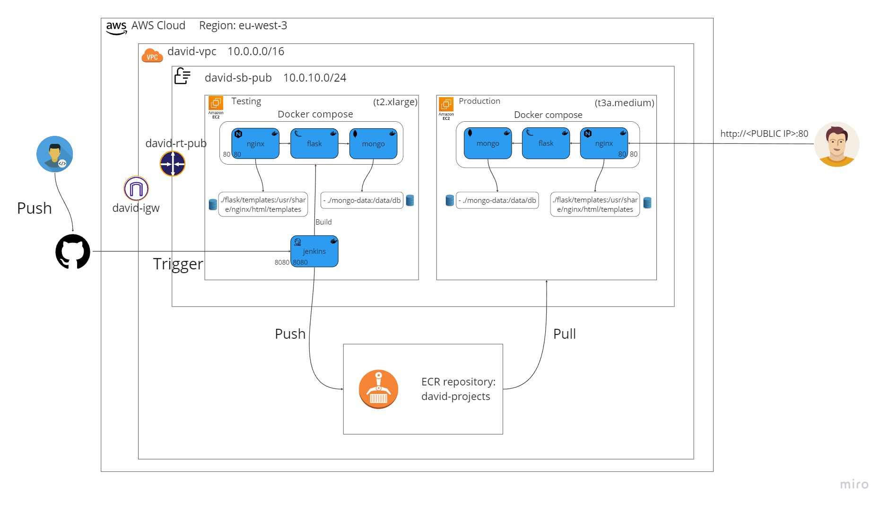

# David Davidov porfolio project 
Which tools the project using for: Cloud - AWS
1. Development: Python flask
2. Containerization: Docker
3. Docker image registry: AWS ECR
4. Source Code Managment: GitHub
5. DataBase: Mongo
6. Scripting: Bash
7. CI/CD: jenkins

## Project Topology:

## AWS
* Note that the public ip addresses changes each time the machines are restarted, if you dont use Elastic IP or DNS so need to make changes in Jenkins base url, Jenkinsfile and GitHub Webhook. 
### EC2: 2 instances
1. **testing** - Testing instance that running the buildings, testings and else.
2. **production** - Production instance that running 24/7.

### ECR: 
**flask-images** - This repository in AWS ECR archived the images that passed the tests and published. 

## Git and GitHub
### Webhook: 
After a push is made, a trigger is activated which notifies Jenkins and activates the job.
### Versioning strategy: 
update the version of the releases in the next files:
1. Evey time that before releasing a new version, need to tag (and push) the commit. For this we have **push-release.sh** in that script you save the changes, commit, tag and push to the remote repository.
2. **CHANGELOG.md** is a file that shows all the versions history and their changes, so when release a new version, recommended to modify this file.

## Jenkins 
To run Jenkins container run the command 'bash jenkins-start.sh'.
### Install docker inside the jenkins container:
curl https://get.docker.com/ > dockerinstall && chmod 777 dockerinstall && ./dockerinstall

* Open Port 8080 in the Security Group for using jenkins.

### Jenkins plugins:
1. GitHub Integration
2. Multibranch Scan Webhook Trigger
3. CloudBees AWS Credentials
4. Extended email notification

### Credential in jenkins:
1. AWS
2. GitHub
3. Email address

* Make sure that you create a webhook.
* Create multibranch pipeline job.

## Application 
### Flask:
### Nginx:
Reverse proxy
### Mongo-DB

## Scripts:
* **delete-tags.sh** that clean the history of tags in local and remote repo if you need.
* **reset.sh** that remove all docker proccess except from the python base image and the jenkins services.
* **prod-reset.sh** almost the same script like "reset.sh", but "prod-reset.sh" dont remove the mongodb volume and python base image.
* **install-docker.sh** install Docker and Docker compose.
* **jenkins-start.sh** run jenkins container.
